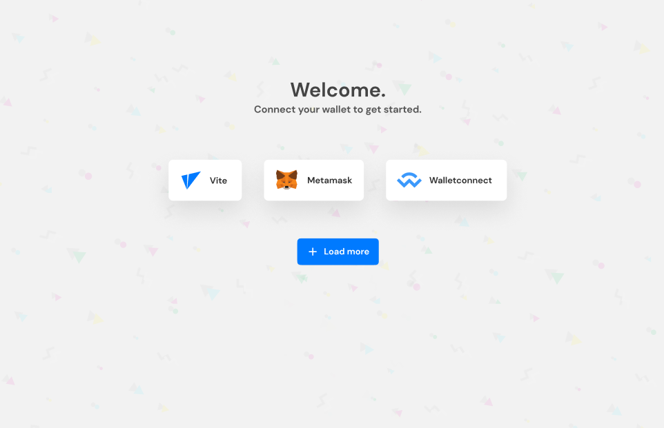
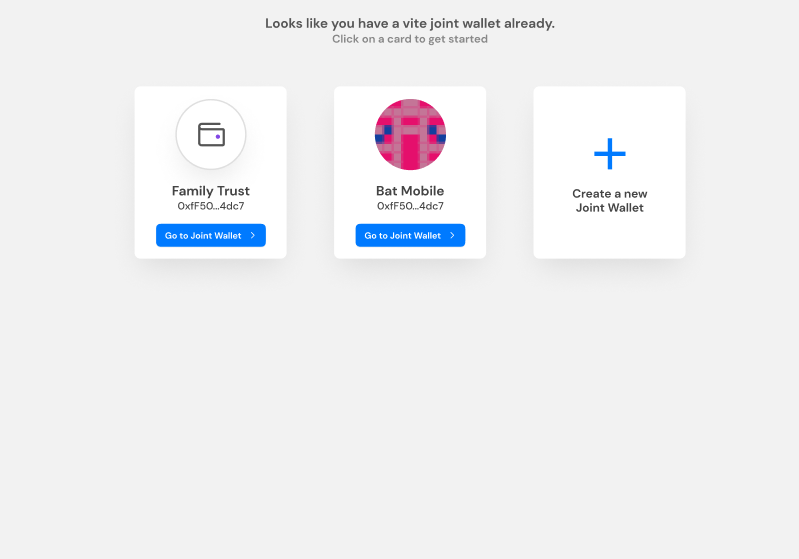
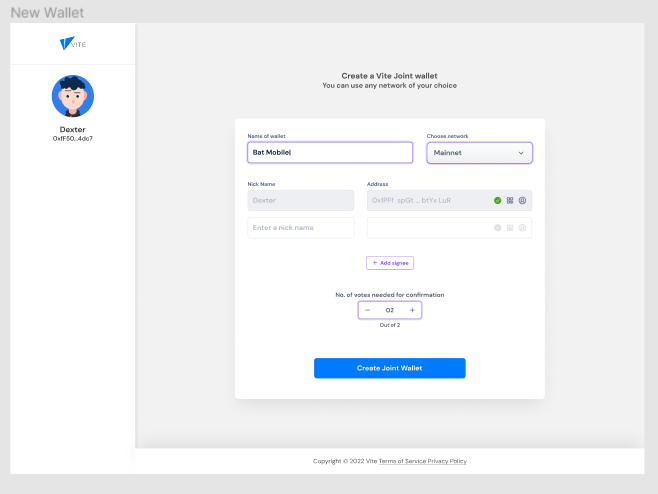
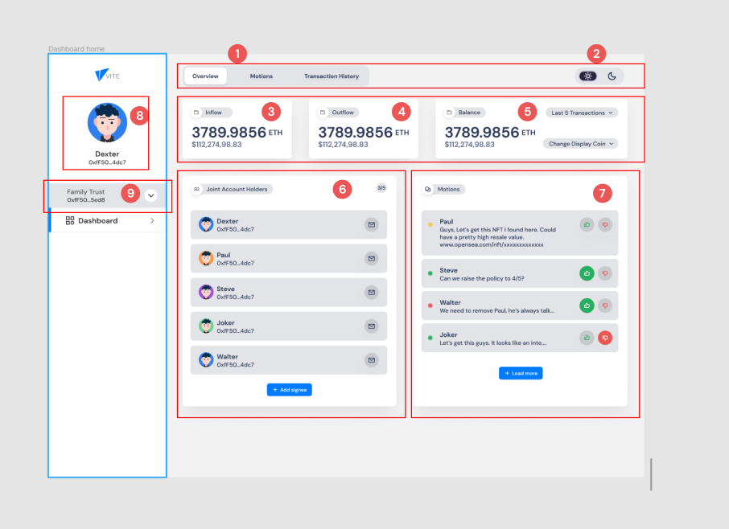
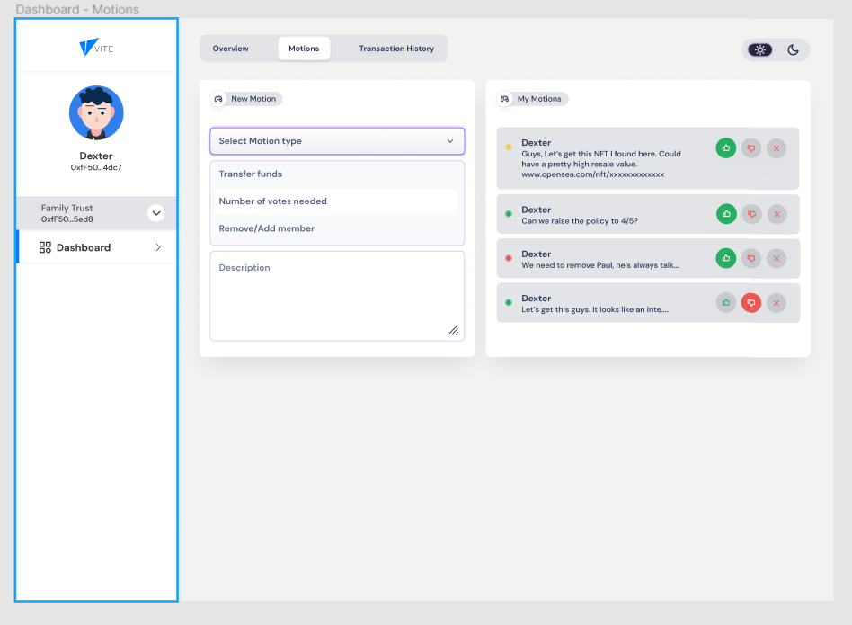
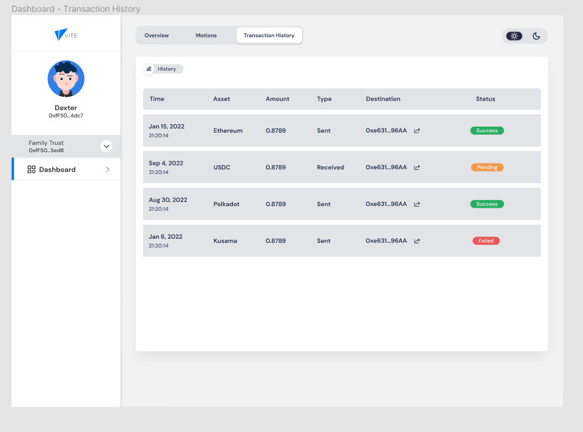

# design-for-vite-joint-account
UI design for Vite joint accounts that would need a certain number of votes to move funds. 

Full Figma file.
https://www.figma.com/file/p2XDkmUSNL4KMIXrcr5sZc/Gitcoin%3A%2FVite-Joint-Account?node-id=0%3A1

*File contains*
1. Landing Page for Web
2. Landing Page for Mobile
3. Light/Dark mode dashboard for joint wallet (web)
4. Light/Dark mode dashboard for joint wallet (mobile)

## Short Documentation
### 1. The journey starts here

Once connect wallet is clicked on the landing page, it redirects to this page where the user is required to connect a wallet. For this demonstration, vite, metamask and walletconnect was used.

Note: Metamask wallet screen wasn't designed since it uses a chrome plugin and connects automatically.

### 2. Choosing an existing wallet or creating a new one
If the connection was successful, it takes you to a page where it shows the user all previously created joint wallets. In addition, the user can also create another wallet on that same page.

If the "Create new joint wallet" card is clicked, the user is redirected to page where a joint wallet can be created

The wallet creation page allows the user to:

- a. Provide a name for the new joint wallet

- b. Choose a network

- c. Add other signees to the joint wallet

- d. Choose number of signee votes needed to confirm a payment or action

Note: The singees would need to create an account(connect wallet) to activate signee privileges

Choosing an existing wallet takes you directly to the dashboard.

### 3. The sauce
The dashboard allows you to perform a lot of useful actions which will be outlined in sections.

#### Overview tab

- Section 1: Shows a tab menu to choose between an account overview, a list of motions you've previously raised and transaction history.

- Section 2: Shows a switch to select a light theme or dark theme.

- Section 3: Shows the total monetary inlow to the joint wallet in ETH and USD.

- Section 4: Shows the total approved monetary outflow from the joint wallet.

- Section 5: Shows the net spend/balance in the joint wallet. There's an option to see the last 5 transactions in a contextual menu and another option to change display currency.

- Section 6: Shows a list of joint wallet owners and also the number of votes/threshold in a simple, understandable fraction needed to approve desicions/motions/transactions at the top right. A messaging feature can can be integrated within the app to communicate with individual signees.

- Seciton 7: Shows a list of proposed motions by joint account holders/signees. Clicking on the "thumbs up" button indicates that the user is voting for the motion to be approved while awaiting the threshold to be reached. Clicking on the "thumbs down" button indicates the reverse. The buttons are designed to with accessibily in mind to allow a colour blind person to be able to easily identify which button is for which. A "remove motion" button wasn't added here since the "thumbs down" button does the same thing for this user. *See Motion tab for how this feature was implemented*

- Section 8: Shows an avatar, name and wallet address of the account owner/singee 

- Section 9: Shows the name and joint wallet address of the joint wallet and a button to choose another joint wallet 

#### Motions tab

- Card 1 (left): The card on the left shows a section for creating a new motion with 3 different motives (transfer funds, change number of votes needed to reach approval threshold, remove a signee).

- Card 2 (right): Shows a list of motions the user/signee has requested from the account. It also spots the thumbs up and thumbs down bottons to allow the user vote against their own motion. In addition to the previous buttons, the user also has the sole privilege of removing motions raised by iteself.

#### Transaction history tab

This section shows a table of all transactions made with the joint wallet.

## Addendum
The responsive/mobile versions of the design are all included in the same document with the link above. 

##### Design system used
Finity Design system: https://finity.polygon.technology/
